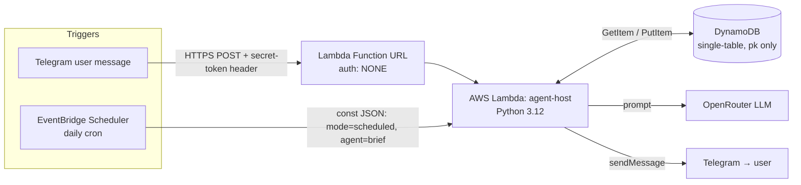

# agent-host

> 🇨🇳 中文说明见 [README.zh.md](README.zh.md).

A small, pluggable **host** for running Telegram-connected AI agents, running **serverless on AWS**. The host owns the shared plumbing — a Telegram channel, an OpenRouter-backed LLM client, a pluggable storage backend, and message routing — while individual **agents** plug in to do the work. Two ship out of the box: `BriefAgent` (a scheduled daily news brief) and `ChatAgent` (free-form conversation with per-chat memory). The *same* codebase runs two ways: a local long-polling process for development, and an AWS Lambda function in production.

## Architecture

One Lambda function, two entry paths, one table:

- A **Telegram webhook** (delivered to a **Lambda Function URL**) drives live chat.
- A daily **EventBridge schedule** fires the *same* Lambda to compose and push the news brief.
- **DynamoDB** holds conversation memory and news-dedup state, so the stateless function has somewhere durable to remember.



**Why these choices:**

- **Serverless (Lambda).** A personal bot is idle almost all the time; pay-per-invocation means ~$0/month within the free tier and nothing to keep running or patch.
- **Function URL, not API Gateway.** The only caller is Telegram's server, so a Lambda Function URL is the minimal public HTTPS endpoint. It's `auth: NONE` (Telegram can't sign AWS SigV4 requests), so the endpoint is guarded **in code**: a **fail-closed secret-token check** (`hmac.compare_digest`; an unset secret returns `403`, never open) plus a **sender allow-list** (only the owner's `chat_id` is served).
- **DynamoDB, single table.** Lambda's filesystem is ephemeral, so state must live externally. The code only ever does `GetItem` / `PutItem` against a single partition key (namespaces are baked into the key, e.g. `brief#memory#42`) — so the IAM policy grants exactly those two actions on exactly that one table. **Least privilege by construction.**
- **Scheduling lives outside the code.** Lambda is passive and can't wake itself, so "run the brief at 4pm" lives in an EventBridge rule, not an env var. Each agent that needs a schedule gets its own rule, so different agents can run at different times with **zero code change**.

## Tech stack & what it demonstrates

| Layer | What's used |
|---|---|
| Language / runtime | Python 3.12 |
| Compute | AWS Lambda (serverless, x86_64) + Lambda Function URL |
| Scheduling | Amazon EventBridge Scheduler (cron) |
| Storage | Amazon DynamoDB (on-demand, single-table, one partition key) |
| Security | IAM least-privilege execution role; fail-closed webhook secret; sender allow-list |
| Config | `pydantic-settings` (12-factor: env-driven; secrets never committed) |
| Integrations | Telegram Bot API (webhook + long-poll); OpenRouter (multi-model with fallbacks) |
| Packaging | `manylinux` / x86_64 wheels built for the Lambda runtime; flat zip |
| Testing | `pytest` + `moto` (mock DynamoDB); fakes / dry-run; env-gated live e2e |
| Observability | Amazon CloudWatch Logs |

**Engineering practices on display:** a pluggable agent architecture (adding an agent ≈ one class + one registry line), 12-factor configuration, least-privilege IAM, cross-platform dependency packaging, webhook security, and test-driven development. The full click-by-click deployment guide lives in **[`infra/aws-runbook.md`](infra/aws-runbook.md)** ([中文版](infra/aws-runbook.zh.md)).

---

## Local quickstart

```bash
python -m venv .venv && source .venv/bin/activate
pip install -e ".[dev]"

cp .env.example .env
# then edit .env and fill in real values (see below)
```

You need, at minimum:

- **`TELEGRAM_BOT_TOKEN`** — message [@BotFather](https://t.me/BotFather) on Telegram, run
  `/newbot`, and it will hand you a token.
- **`TELEGRAM_CHAT_ID`** — send your new bot any message first (bots can't message you until you
  message them), then visit
  `https://api.telegram.org/bot<TOKEN>/getUpdates` in a browser and read `message.chat.id` from
  the JSON response. (Or just message [@userinfobot](https://t.me/userinfobot) to get your own
  chat ID directly.)
- **`OPENROUTER_API_KEY`** — from https://openrouter.ai/keys. The default model is
  `deepseek/deepseek-v3.2` (see `LLM_MODEL` in `.env.example`), with `qwen/qwen3.6-plus` and
  `google/gemini-2.5-flash` configured as automatic fallback models if the primary is unavailable.

Everything else in `.env.example` has a sensible local default (`STORE_BACKEND=sqlite`,
`TIMEZONE=Asia/Shanghai`, `ENABLED_AGENTS=brief, chat`, `DEFAULT_AGENT=chat`, ...) — leave those
as-is to start.

Run the tests:

```bash
pytest
```

One test (`tests/test_e2e_local.py`) is skipped by default because it sends a **real** message to
your real Telegram chat — it only runs if you export `RUN_E2E=1` with a fully-populated `.env`.

Try the agents locally:

```bash
# Run the brief agent once, right now, from the command line:
python -m agent_host.entrypoints.local_run run brief

# Or run a long-poll loop that answers real Telegram messages (Ctrl-C to stop):
python -m agent_host.entrypoints.local_run serve
```

For `serve` to receive anything, open Telegram and send your bot a `/start` (or any message) —
Telegram only delivers messages to a bot after a user has messaged it at least once. Send it
`/brief` to get the news brief on demand, or just chat with it normally (routed to `ChatAgent` by
default).

## How to add a new agent

An agent is any class implementing the `Agent` interface (`src/agent_host/agents/base.py`):

```python
class Agent:
    name: str = "agent"
    schedule: str | None = None       # cron expr, informational — actual scheduling is external (EventBridge)
    commands: list[str] = []          # slash-commands this agent owns, e.g. ["/brief"]
    intent: str | None = None         # NL description, for future LLM-based routing

    def run_scheduled(self, svc: Services) -> None: ...
    def handle_message(self, msg: InboundMessage, svc: Services) -> str | None: ...
```

To add your own:

1. **Subclass `Agent`** somewhere under `src/agent_host/agents/` (follow the existing
   `agents/brief/` or `agents/chat/` package layout as a template). Set `name` to a short unique
   string — this is the key used everywhere the agent is looked up.
2. **Implement whichever entry points apply:**
   - `run_scheduled(self, svc)` — called for scheduled/cron-triggered work (e.g. what
     `BriefAgent` does once a day). `svc` is a `Services` bundle giving you `svc.channel` (send
     messages), `svc.llm` (call the configured LLM), `svc.store` (a `Store`, already namespaced to
     your agent's `name` so your keys can't collide with another agent's), and `svc.config`.
   - `handle_message(self, msg, svc)` — called when this agent is routed an inbound Telegram
     message (`msg: InboundMessage` has `.chat_id`, `.text`, `.message_id`, `.raw`). Return a
     `str` to have the `Host` send it back as the reply, or `None` to send nothing.
   - Set `commands = ["/yourcommand"]` if you want the `Host` to route messages starting with that
     slash-command straight to your agent regardless of the default agent (see `Host._route` in
     `src/agent_host/host.py`); otherwise your agent only receives messages when it's the
     configured `DEFAULT_AGENT`.
3. **Register it** in `src/agent_host/registry.py`. There is **no** module-level
   `AGENT_FACTORIES` constant — the registry point is the `_agent_factories()` function:
   ```python
   def _agent_factories() -> dict:
       from agent_host.agents.brief.agent import BriefAgent
       from agent_host.agents.chat.agent import ChatAgent
       from agent_host.agents.yours.agent import YourAgent   # add your import
       return {"brief": BriefAgent, "chat": ChatAgent, "yours": YourAgent}  # add your entry
   ```
   `build_agents()` only instantiates agents whose name appears in this dict **and** in
   `config.enabled_agents`, so both steps below are required.
4. **Enable it** by adding its name to `ENABLED_AGENTS` in `.env` (comma-separated, e.g.
   `ENABLED_AGENTS=brief, chat, yours`) — this is read by `Config.enabled_agents` and is what
   `build_agents()` filters against.
5. If it should run on a schedule in production, add a matching EventBridge schedule targeting the
   Lambda with input `{"mode": "scheduled", "agent": "yours"}` — see
   [`infra/aws-runbook.md`, Section 8](infra/aws-runbook.md#8-create-the-daily-schedule-eventbridge).

Write a test under `tests/` alongside the existing `test_brief_agent.py` / `test_chat_agent.py` as
a model — the host and services are simple enough to construct directly with fakes/dry-run mode,
no AWS or network access required.

## Deploying to AWS

Local `serve` (long-polling) is fine for development but isn't meant to run unattended forever.
For a real always-on deployment — Telegram webhook via a Lambda Function URL, plus a daily
EventBridge schedule for the brief, backed by DynamoDB instead of the local SQLite file — follow
the full click-by-click guide in **[`infra/aws-runbook.md`](infra/aws-runbook.md)**. It covers
prerequisites, the DynamoDB table, the IAM role, packaging and uploading the Lambda zip, wiring up
the webhook, the EventBridge cron schedule, end-to-end verification, and cost/teardown.
