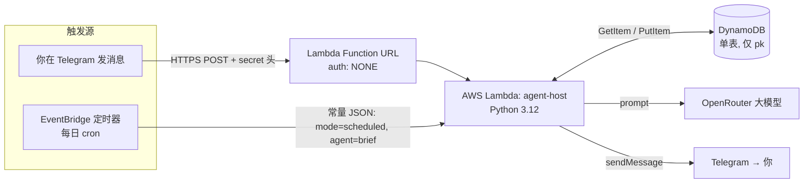

# agent-host(中文说明)

> English version: [README.md](README.md)。代码、命令、标识符、配置键一律保留原样,不翻译。

`agent-host` 是一个小巧、可插拔的**宿主(host)**,用来运行接入 Telegram 的 AI agent,**以 serverless 方式跑在 AWS 上**。宿主持有共享的底层设施——一个 Telegram 通道、一个基于 OpenRouter 的 LLM 客户端、一个可插拔的存储后端(本地 SQLite,云上 DynamoDB),以及消息路由——各个 **agent** 插进来干实际的活。开箱自带两个:`BriefAgent`(按计划推送每日新闻简报)和 `ChatAgent`(带每会话记忆的自由对话)。**同一套代码**有两种跑法:本地 long-polling 进程(开发),AWS Lambda 函数(生产)。

## 架构总览

一个 Lambda 函数、两条入口、一张表:

- **Telegram webhook**(经由 **Lambda Function URL**)驱动实时聊天。
- 每日 **EventBridge 定时**触发**同一个** Lambda,去组装并推送新闻简报。
- **DynamoDB** 保存对话记忆和新闻去重状态——给这个无状态的函数一个持久的"记忆仓库"。



**为什么这么设计:**

- **Serverless(Lambda)。** 个人 bot 绝大多数时间是空闲的;按调用计费意味着免费额度内 ~$0/月,也没有一直开着的服务器要运维、打补丁。
- **用 Function URL 而不是 API Gateway。** 唯一的调用方是 Telegram 服务器,所以 Lambda Function URL 就是那个最小的公开 HTTPS 端点。它是 `auth: NONE`(Telegram 无法对 AWS SigV4 请求签名),因此保护落在**代码里**:一个**失败关闭的 secret 校验**(`hmac.compare_digest`;secret 未配置直接返 `403`,绝不敞开)外加一个**发件人白名单**(只服务本人的 `chat_id`)。
- **DynamoDB 单表。** Lambda 文件系统是临时的,状态必须放到外部。代码全程只对一个分区键做 `GetItem` / `PutItem`(命名空间编进 key 里,如 `brief#memory#42`)——所以 IAM 策略也就只授予这两个动作、只限这一张表。**最小权限,天然如此。**
- **调度不写在代码里。** Lambda 是被动的、不能自己唤醒自己,所以"下午 4 点跑简报"住在 EventBridge 规则里,而不是环境变量。每个需要定时的 agent 各有一条规则,于是不同 agent 可以在不同时间跑,**零代码改动**。

## 技术栈与亮点

| 层面 | 用了什么 |
|---|---|
| 语言 / 运行时 | Python 3.12 |
| 计算 | AWS Lambda(serverless,x86_64)+ Lambda Function URL |
| 调度 | Amazon EventBridge Scheduler(cron) |
| 存储 | Amazon DynamoDB(按需计费,单表,单分区键) |
| 安全 | IAM 最小权限执行角色;失败关闭的 webhook secret;发件人白名单 |
| 配置 | `pydantic-settings`(十二要素:环境变量驱动;密钥绝不入库) |
| 集成 | Telegram Bot API(webhook + long-poll);OpenRouter(多模型带回退) |
| 打包 | 为 Lambda 运行时构建的 `manylinux` / x86_64 wheel;扁平 zip |
| 测试 | `pytest` + `moto`(模拟 DynamoDB);fake / dry-run;环境变量开关的真实 e2e |
| 可观测 | Amazon CloudWatch Logs |

**体现的工程实践:** 可插拔的 agent 架构(加一个 agent ≈ 一个类 + 一行注册)、十二要素配置、最小权限 IAM、跨平台依赖打包、webhook 安全、测试驱动开发。完整的点击级部署指南见 **[`infra/aws-runbook.zh.md`](infra/aws-runbook.zh.md)**([English](infra/aws-runbook.md))。

---

## 本地快速开始

```bash
python -m venv .venv && source .venv/bin/activate
pip install -e ".[dev]"

cp .env.example .env
# 然后编辑 .env 填入真实值(见下)
```

至少需要:

- **`TELEGRAM_BOT_TOKEN`** —— 在 Telegram 上找 [@BotFather](https://t.me/BotFather),运行 `/newbot`,它会给你一个 token。
- **`TELEGRAM_CHAT_ID`** —— 先给你的新 bot 发任意一条消息(bot 在你先发消息之前无法主动给你发),然后在浏览器打开 `https://api.telegram.org/bot<TOKEN>/getUpdates`,从 JSON 里读 `message.chat.id`。(或者直接找 [@userinfobot](https://t.me/userinfobot) 拿你自己的 chat ID。)
- **`OPENROUTER_API_KEY`** —— 从 https://openrouter.ai/keys 获取。默认模型是 `deepseek/deepseek-v3.2`(见 `.env.example` 里的 `LLM_MODEL`),并配置了 `qwen/qwen3.6-plus` 和 `google/gemini-2.5-flash` 作为主模型不可用时的自动回退模型。

`.env.example` 里其余项都有合理的本地默认值(`STORE_BACKEND=sqlite`、`TIMEZONE=Asia/Shanghai`、`ENABLED_AGENTS=brief, chat`、`DEFAULT_AGENT=chat`、……)——开始时保持原样即可。

跑测试:

```bash
pytest
```

有一个测试(`tests/test_e2e_local.py`)默认被跳过,因为它会给你真实的 Telegram 聊天发一条**真消息**——只有当你在填好 `.env` 的前提下 export `RUN_E2E=1` 时它才会运行。

本地试用这些 agent:

```bash
# 立刻从命令行运行一次 brief agent:
python -m agent_host.entrypoints.local_run run brief

# 或运行一个 long-poll 循环,回应真实的 Telegram 消息(Ctrl-C 停止):
python -m agent_host.entrypoints.local_run serve
```

要让 `serve` 收到消息,先打开 Telegram 给你的 bot 发一个 `/start`(或任意消息)——Telegram 只有在用户至少给 bot 发过一次消息后才会向该 bot 投递消息。发 `/brief` 可按需获取新闻简报,或者直接正常和它聊天(默认路由到 `ChatAgent`)。

## 如何添加一个新 agent

一个 agent 就是任意实现了 `Agent` 接口(`src/agent_host/agents/base.py`)的类:

```python
class Agent:
    name: str = "agent"
    schedule: str | None = None       # cron expr, informational — actual scheduling is external (EventBridge)
    commands: list[str] = []          # slash-commands this agent owns, e.g. ["/brief"]
    intent: str | None = None         # NL description, for future LLM-based routing

    def run_scheduled(self, svc: Services) -> None: ...
    def handle_message(self, msg: InboundMessage, svc: Services) -> str | None: ...
```

添加你自己的:

1. **继承 `Agent`**,放在 `src/agent_host/agents/` 下某处(以现有的 `agents/brief/` 或 `agents/chat/` 包布局为模板)。把 `name` 设为一个简短唯一的字符串——它是查找该 agent 时到处用到的键。
2. **实现适用的入口方法:**
   - `run_scheduled(self, svc)` —— 用于定时/cron 触发的工作(例如 `BriefAgent` 每天做的事)。`svc` 是一个 `Services` 束,给你 `svc.channel`(发消息)、`svc.llm`(调用配置好的 LLM)、`svc.store`(一个 `Store`,已按你 agent 的 `name` 做好命名空间,所以你的键不会和别的 agent 冲突)、以及 `svc.config`。
   - `handle_message(self, msg, svc)` —— 当有入站 Telegram 消息路由到这个 agent 时被调用(`msg: InboundMessage` 有 `.chat_id`、`.text`、`.message_id`、`.raw`)。返回一个 `str` 让 `Host` 把它作为回复发回,或返回 `None` 表示不发。
   - 如果你想让 `Host` 把以某个 slash 命令开头的消息不管默认 agent 是谁都直接路由给你的 agent,就设 `commands = ["/yourcommand"]`(见 `src/agent_host/host.py` 里的 `Host._route`);否则你的 agent 只有在它是配置的 `DEFAULT_AGENT` 时才会收到消息。
3. **注册它**,在 `src/agent_host/registry.py` 里。这里**没有**模块级的 `AGENT_FACTORIES` 常量——注册点是 `_agent_factories()` 函数:
   ```python
   def _agent_factories() -> dict:
       from agent_host.agents.brief.agent import BriefAgent
       from agent_host.agents.chat.agent import ChatAgent
       from agent_host.agents.yours.agent import YourAgent   # add your import
       return {"brief": BriefAgent, "chat": ChatAgent, "yours": YourAgent}  # add your entry
   ```
   `build_agents()` 只会实例化那些名字**既**出现在这个 dict 里**又**出现在 `config.enabled_agents` 里的 agent,所以下面两步都必需。
4. **启用它**,把它的名字加进 `.env` 的 `ENABLED_AGENTS`(逗号分隔,例如 `ENABLED_AGENTS=brief, chat, yours`)——这会被 `Config.enabled_agents` 读取,也是 `build_agents()` 过滤的依据。
5. 如果它应在生产中定时运行,加一条对应的 EventBridge 计划,目标为该 Lambda、输入为 `{"mode": "scheduled", "agent": "yours"}`——见 [`infra/aws-runbook.zh.md` 第 8 节](infra/aws-runbook.zh.md#8-创建每日定时任务eventbridge)。

以现有的 `test_brief_agent.py` / `test_chat_agent.py` 为模板,在 `tests/` 下写一个测试——host 和 services 都足够简单,可以直接用 fake/dry-run 模式构造,不需要 AWS 或网络访问。

## 部署到 AWS

本地 `serve`(long-polling)开发时够用,但不适合长期无人值守运行。要做一个真正常驻的部署——通过 Lambda Function URL 接 Telegram webhook,加上每日 EventBridge 定时任务推简报,存储用 DynamoDB 而非本地 SQLite 文件——请照着 **[`infra/aws-runbook.zh.md`](infra/aws-runbook.zh.md)** 里完整的点击级指南。它涵盖了准备工作、DynamoDB 表、IAM 角色、打包并上传 Lambda zip、接好 webhook、EventBridge cron 定时、端到端验证,以及成本/拆除。
